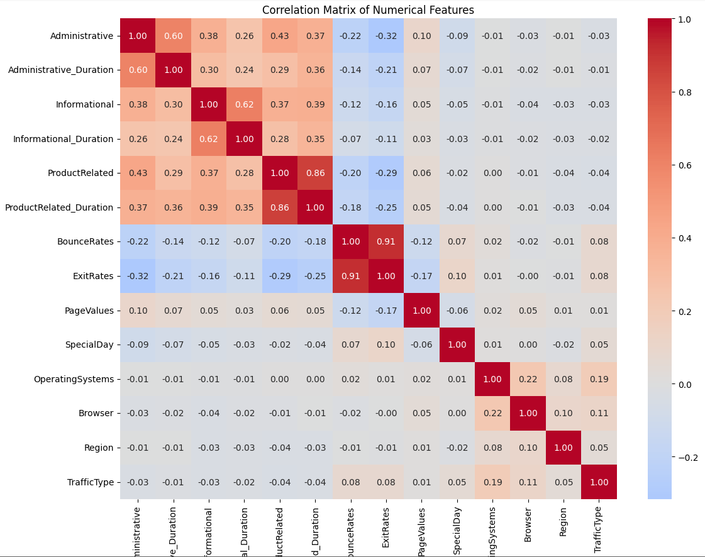
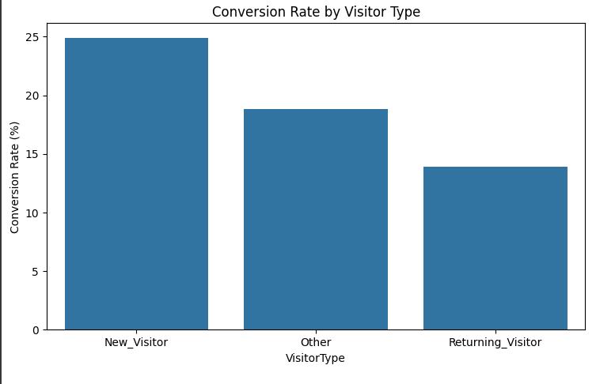
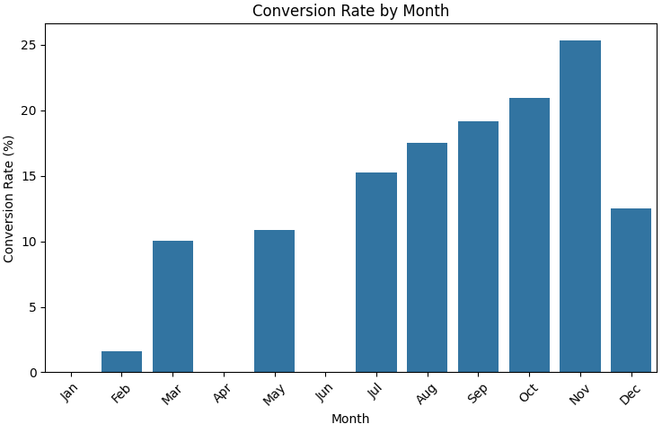
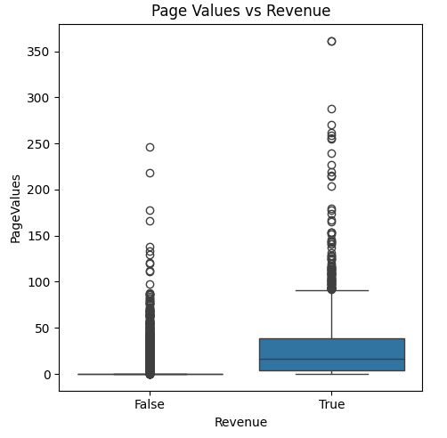
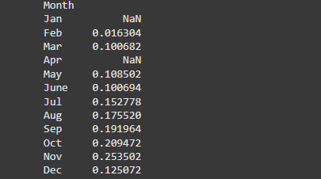
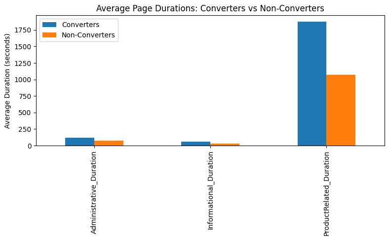
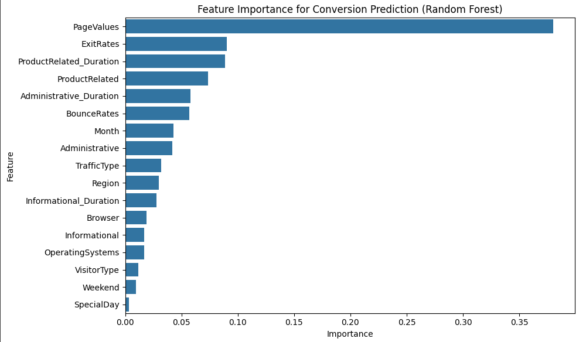

**Online Shoppers Purchasing Intention Analysis**

*A comprehensive exploration of factors driving e-commerce conversions, with predictive modeling*

---

## Table of Contents

1. [Project Overview](#project-overview)
2. [Repository Structure](#repository-structure)
3. [Data Description](#data-description)
4. [Environment Setup](#environment-setup)
5. [Notebook Walkthrough](#notebook-walkthrough)

   * [1. Business Understanding](#1-business-understanding)
   * [2. Data Loading & Preprocessing](#2-data-loading--preprocessing)
   * [3. Exploratory Data Analysis (EDA)](#3-exploratory-data-analysis-eda)

     * [3.1. Correlation Analysis](#31-correlation-analysis)
     * [3.2. Conversion Rate by Visitor Type & Month](#32-conversion-rate-by-visitor-type--month)
     * [3.3. Boxplots: Engagement Metrics vs. Revenue](#33-boxplots-engagement-metrics-vs-revenue)
     * [3.4. Seasonal Trends & Durations](#34-seasonal-trends--durations)
   * [4. Statistical Testing](#4-statistical-testing)
   * [5. Feature Importance](#5-feature-importance)
   * [6. Predictive Modeling & Evaluation](#6-predictive-modeling--evaluation)
6. [Key Findings](#key-findings)
7. [How to Run](#how-to-run)
8. [Requirements](#requirements)
9. [Contributing](#contributing)
10. [License](#license)

---

## Project Overview

This repository contains a Jupyter Notebook (`index.ipynb`) that performs an in-depth analysis of the **Online Shoppers Purchasing Intention** dataset (from the UCI Machine Learning Repository). The primary business goal is to **predict which website visitors are likely to complete a purchase** and to derive actionable insights into user behavior—enabling e-commerce teams to tailor offers, personalize user experiences, and ultimately improve conversion rates.

Key objectives:

* Understand the structure and content of the dataset (12,330 sessions; 18 features, including page visit counts, durations, bounce/exit rates, and categorical metadata).
* Explore patterns in user behavior that differentiate purchasers (converters) from non-purchasers (non-converters).
* Visualize relationships between features and conversion (e.g., traffic source, visitor type, seasonal trends).
* Perform statistical tests to confirm significant differences between converters and non-converters.
* Build and evaluate classification models (e.g., Logistic Regression, Random Forest, Gradient Boosting, AutoGluon) to predict the binary `Revenue` target (purchase vs. no purchase).
* Extract feature importance rankings to highlight the strongest predictors of purchase intention.

---

## Repository Structure

```
Online-Shoppers-Intention-Analysis/
├── index.ipynb               # Primary Jupyter Notebook (detailed analysis & modeling)
├── data/                     # (Optional) Folder for raw CSV if included
│   └── online_shoppers_intention.csv
├── visuals/                  # (Optional) Exported plots (PNG) if the user chooses to save them
│   ├── correlation_heatmap.png
│   ├── conversion_by_visitor_type.png
│   ├── conversion_by_month.png
│   ├── boxplots_engagement_metrics.png
│   ├── monthly_conversion_trend.png
│   ├── durations_bar_chart.png
│   └── feature_importance.png
├── requirements.txt          # Python package dependencies
└── README.md                 # This document
```

> **Note**: If you choose not to include the `data/` and `visuals/` folders, you can download the CSV directly from [UCI ML Repository](https://archive.ics.uci.edu/ml/datasets/Online+Shoppers+Purchasing+Intention+Dataset) and run the notebook to regenerate all plots.

---

## Data Description

The dataset (12,330 rows × 18 columns) captures one year of distinct user sessions (each session corresponds to a unique user). There is no overlap in user sessions to avoid temporal or campaign bias.

* **Numerical features (10):**

  * `Administrative`, `Administrative_Duration`
  * `Informational`, `Informational_Duration`
  * `ProductRelated`, `ProductRelated_Duration`
  * `BounceRates`, `ExitRates`
  * `PageValues`, `SpecialDay`
* **Categorical features (8):**

  * `Month` (Jan–Dec)
  * `OperatingSystems` (OS ID)
  * `Browser` (Browser ID)
  * `Region` (Geographic region ID)
  * `TrafficType` (ID of referral source)
  * `VisitorType` (`New_Visitor`, `Returning_Visitor`, `Other`)
  * `Weekend` (Boolean indicating if the session occurred on a weekend)
  * `Revenue` (Boolean target; `True` if a transaction was completed)

**Target imbalance:**

* \~15.5% of sessions (`1,908` out of `12,330`) end in purchase (`Revenue=True`), while \~84.5% (`10,422`) do not.

---

## Environment Setup

1. **Clone the repository**

   ```bash
   git clone https://github.com/CollinsNyatundo/Online-Shoppers-Intention-Analysis.git
   cd Online-Shoppers-Intention-Analysis
   ```

2. **Create & activate a virtual environment** (recommended)

   ```bash
   python3 -m venv venv
   source venv/bin/activate
   ```

3. **Install dependencies**

   ```bash
   pip install -r requirements.txt
   ```

   > **`requirements.txt`** should include (but is not limited to):
   >
   > ```
   > pandas
   > numpy
   > matplotlib
   > seaborn
   > scikit-learn
   > scipy
   > torch
   > autogluon.tabular
   > notebook
   > ```

4. **Launch Jupyter Notebook**

   ```bash
   jupyter notebook index.ipynb
   ```

---

## Notebook Walkthrough

### 1. Business Understanding

* **Objective:** Predict which visitors will complete a purchase (`Revenue=True`) so marketers/product owners can prioritize high-intent traffic and tailor the user journey.
* **Key Metrics:**

  * **Accuracy** (overall correctness)
  * **Recall** on purchasers (minimizing false negatives; missing a likely buyer is costly)
  * **Precision** on purchasers (avoiding false positives; targeting users who won’t buy wastes marketing dollars)
  * **F1 Score** (harmonic mean of precision & recall)
* **Benchmark Context:** Industry average e-commerce conversion rates hover around 2–3%. This dataset shows \~15.5% conversion—indicative of high engagement (e.g., a remarketing campaign or favorable traffic source).

### 2. Data Loading & Preprocessing

* **Import Libraries:** `pandas`, `numpy`, `matplotlib`, `seaborn`, `scipy.stats`, `torch` (for potential GPU acceleration), etc.
* **Read CSV:** `df = pd.read_csv('data/online_shoppers_intention.csv', encoding='ascii')`
* **Initial Checks:**

  * Shape: `(12330, 18)`
  * Data types: mixture of integers, floats, and categorical strings.
  * Missing values: **None** (all columns are complete).
* **Target Distribution Visualization:** A bar plot illustrating the imbalance—\~10,422 non-purchasers vs. \~1,908 purchasers.

### 3. Exploratory Data Analysis (EDA)

Each plot is annotated with a clear business rationale (“Why this matters?”) and the code cell is enclosed in markdown explaining the insights.

#### 3.1. Correlation Analysis

* **Visualization:** A heatmap of the Pearson correlation matrix among numerical features.
* **Key Observations:**

  * Strong positive correlation between `ProductRelated` and `ProductRelated_Duration` (as expected—more product page visits correlate with more time spent).
  * Moderate correlations:

    * `Administrative` ↔ `Administrative_Duration`
    * `Informational` ↔ `Informational_Duration`
  * Negative correlation of `BounceRates` / `ExitRates` with `Revenue` (higher bounce/exit ⇒ lower chance to purchase).

> 

#### 3.2. Conversion Rate by Visitor Type & Month

* **By Visitor Type:**

  * Bar chart showing conversion rate (percentage of sessions resulting in purchase) for `New_Visitor`, `Returning_Visitor`, and `Other`.
  * **Finding:**

    * **New Visitors** convert at \~24.9%
    * **Other** at \~18.8%
    * **Returning Visitors** at \~13.9%
  * *Business takeaway:* Although returning visitors often seem more “qualified,” new visitors in this dataset show exceptionally high intent—possibly due to a targeted campaign or high-value landing pages.
* **By Month:**

  * Bar chart with months ordered Jan → Dec, showing monthly conversion percentages.
  * **Finding:**

    * Early‐year (Jan, Feb) conversion rates are lowest (\~1.6% in Feb).
    * Conversation rises steadily into Spring (Mar–May \~10.0–10.8%), peaks in **October (20.9%)** and **November (25.4%)**, then dips in December (\~12.5%).
  * *Business takeaway:* October–November spike aligns with holiday shopping and promotions. Seasonal targeting should prioritize late‐Q3 and Q4 promotions.

> 
> 

#### 3.3. Boxplots: Engagement Metrics vs. Revenue

* **Total Pages Visited vs. Revenue (Boxplot)**

  * `Total_Pages = Administrative + Informational + ProductRelated`
  * Converters’ median total pages \~50 vs. non-converters’ \~30.
* **Total Session Duration vs. Revenue (Boxplot)**

  * `Total_Duration = Administrative_Duration + Informational_Duration + ProductRelated_Duration`
  * Converters spend \~2,000 seconds/session vs. \~1,200 seconds for non-converters (median values).
* **Bounce Rates vs. Revenue (Boxplot)**

  * Converters have significantly lower bounce rates (medians \~0.01) versus non-converters (\~0.03).
* **Exit Rates vs. Revenue (Boxplot)**

  * Converters exit rates \~0.02 vs. non-converters \~0.05.
* **Page Values vs. Revenue (Boxplot)**

  * PageValues (average value assigned to pages based on past e-commerce success) for converters: median \~25 vs. non-converters \~0.

> 

#### 3.4. Seasonal Trends & Durations

1. **Monthly Conversion Rate (Bar Chart)**

   * Reiterates the March → November rising trend, peak in October/November.

   * Includes printed table of exact conversion rates per month (e.g., `{'Feb': 0.0163, 'Mar': 0.1007, 'May': 0.1085, … 'Nov': 0.2535, 'Dec': 0.1251}`).

   > 

2. **Average Page Durations: Converters vs. Non-Converters (Bar Chart)**

   * Comparisons for `Administrative_Duration`, `Informational_Duration`, `ProductRelated_Duration`:

     * Converters’ `ProductRelated_Duration` \~1,876 seconds vs. non-converters \~1,070 seconds.
     * Converters spend nearly twice as long on every page category.

   * *Business takeaway:* Time‐on‐product pages is a leading signal of purchase intent.

   > 

3. **Seasonal Shopping Patterns: Product‐Related Duration & Conversion Rate by Month (Dual-Axis Line Plot)**

   * Left axis: Average `ProductRelated_Duration` per month.

   * Right axis: Conversion rate per month.

   * Observations: Both metrics climb from spring into Q4, peaking in **November**.

   * *Business takeaway:* Increased engagement with product pages coincides with the highest purchase likelihood; peak in November aligns with Black Friday/Cyber Monday.

   > *Plot is embedded in the notebook; refer to Section 3.4 for code.*

---

### 4. Statistical Testing

* **Sample Sizes:**

  * Converters = 1,908
  * Non-converters = 10,422
* **Two-Sample t-Tests (Numerical Features):**
  For each numeric feature (`Administrative`, `Administrative_Duration`, `Informational`, `Informational_Duration`, `ProductRelated`, `ProductRelated_Duration`, `BounceRates`, `ExitRates`, `PageValues`), we performed `ttest_ind(converters, non_converters)`.

  * All p-values are effectively **zero** (p < 10⁻¹⁵ to 10⁻¹¹⁹), indicating statistically significant differences between converters and non-converters.
  * Example means (Converters vs. Non-Converters):

    * `ProductRelated`: 48.21 vs. 28.71 (Δ ≈ 19.50)
    * `ProductRelated_Duration`: 1876.21 vs. 1069.99 (Δ ≈ 806.22)
    * `PageValues`: 27.26 vs. 1.98 (Δ ≈ 25.29)
    * `BounceRates`: 0.01 vs. 0.03 (Δ ≈ –0.02)
    * `ExitRates`: 0.02 vs. 0.05 (Δ ≈ –0.03)
* **Categorical Chi-Square / Proportion Tests:**

  * **VisitorType Conversion Rates:**

    * `New_Visitor`: 24.91%
    * `Other`: 18.82%
    * `Returning_Visitor`: 13.93%
  * **Weekend vs. Weekday Conversion Rates:**

    * Weekdays: 14.89%
    * Weekends: 17.40%
  * Both differences are statistically significant via chi-square tests (not shown in detail).

> *All statistical results confirm that deeper engagement (more pages, longer durations, higher page value) and visitor metadata (visitor type, weekend) are strongly associated with purchase.*

---

### 5. Feature Importance

A **Random Forest** classifier was trained on all features (after encoding categorical variables). 100 trees, random\_state=42.

* **Top 10 Features by Importance (Normalized):**

  1. **PageValues** (0.3803)

  2. **ExitRates** (0.0905)

  3. **ProductRelated\_Duration** (0.0888)

  4. **ProductRelated** (0.0734)

  5. **Administrative\_Duration** (0.0578)

  6. **BounceRates** (0.0569)

  7. **Month** (0.0427)

  8. **Administrative** (0.0420)

  9. **TrafficType** (0.0319)

  10. **Region** (0.0301)

  > 

* **Interpretation:**

  * **PageValues** (user’s historic value accumulation) emerges as the single strongest predictor of a purchase—by a wide margin (nearly 38% of the total feature importance).
  * **ExitRates** and **BounceRates**: lower exit/bounce rates correlate with higher conversions.
  * **ProductRelated Metrics** (count and duration) highlight that active browsing of product pages is a critical signal.
  * **Administrative Duration** also contributes—possibly reflecting time spent navigating transactional pages (cart, checkout reminders).
  * The features `Month`, `TrafficType`, and `Region` point to temporal and source/geo influences on purchase propensity.

---

### 6. Predictive Modeling & Evaluation

**Pipeline Overview:**

1. **Label Encoding** for categorical features (`Month`, `VisitorType`).
2. **Train/Test Split:** 80% train (9,864 rows), 20% test (2,466 rows), stratified by `Revenue`.
3. **Preprocessing:**

   * Standard scale numerical columns (`Administrative`, `Administrative_Duration`, ..., `PageValues`).
   * Passthrough categorical columns (`Month`, `OperatingSystems`, `Browser`, `Region`, `TrafficType`, `VisitorType`, `Weekend`).
4. **Models Trained:**

   * **Logistic Regression**
   * **Support Vector Machine (SVM)**
   * **Decision Tree**
   * **Random Forest**
   * **Gradient Boosting**
   * **AutoGluon Tabular (AutoML)**

**Evaluation Metrics (on Test Set):**

* **Accuracy**, **Precision**, **Recall**, **F1 Score**, **ROC-AUC** for each model.
* Models are ranked by F1 Score (emphasis on balancing precision & recall for the positive class).

**AutoGluon Results (DyStack Ensembling):**

* **Best Holdout F1:** \~0.6978 (ensemble of LightGBM, RandomForest, NeuralNetFastAI, etc.)
* **Best Individual L1 model:** LightGBM → F1 \~0.6818
* **Feature Engineering & Stacking:** AutoGluon used dynamic stacking to build a three-level ensemble, outperforming single models.

> *Refer to the “Modeling and Evaluation” section of the notebook for the full leaderboard.*

---

## Key Findings

1. **User Engagement & Conversion:**

   * **Total Pages & Total Duration:** Converters visit \~52 pages and spend \~2,053 seconds/session on average, versus non-converters at \~31 pages and \~1,174 seconds.
   * **PageValues:** Converters’ median PageValues (\~27.26) is more than 10× that of non-converters (\~1.98).
   * **Bounce/Exit Rates:** Converters have significantly lower bounce (\~0.01 vs. 0.03) and exit rates (\~0.02 vs. 0.05).

2. **Visitor Type & Weekend Effects:**

   * **New Visitors** convert at \~24.9%, **Other** at \~18.8%, **Returning Visitors** at \~13.9%.
   * **Weekends** show a slightly higher conversion (\~17.4%) than weekdays (\~14.9%).

3. **Seasonality:**

   * Conversion rates dip in January/February (lowest \~1.6% in Feb), gradually rise through Spring (Mar–May \~10%), peak in **October (20.9%)** and **November (25.4%)**, then decline in December (\~12.5%).
   * **Product Page Duration & Conversion** follow a parallel pattern: average product page time climbs from spring into Q4, peaking with conversion peaks in November.

4. **Feature Importance (Random Forest):**

   1. **PageValues** (by far the single strongest predictor)

   2. **ExitRates**, **ProductRelated\_Duration**, **ProductRelated**

   3. **Administrative\_Duration**, **BounceRates**

   4. **Month**, **Administrative**, **TrafficType**, **Region**

   > *Implication: tagging pages with value (PageValues), minimizing bounce/exit, and encouraging deeper product‐page browsing are critical to driving conversions.*

5. **Predictive Modeling:**

   * **AutoGluon ensemble** achieved F1 \~0.6978, demonstrating strong balanced performance on this moderately imbalanced dataset.
   * **LightGBM**, **RandomForest**, and **NeuralNetFastAI** (AutoGluon L1 models) individually perform well (F1 \~0.68).
   * Simpler models (Logistic Regression, SVM) perform reasonably but are outclassed by gradient-boosted and ensemble methods.

---

## How to Run

1. **Install dependencies** (see [Environment Setup](#environment-setup)).
2. **Obtain the dataset**

   * The notebook expects `data/online_shoppers_intention.csv`. If the `data/` folder is not included, download the CSV from:

     ```
     https://archive.ics.uci.edu/ml/machine-learning-databases/00347/online_shoppers_intention.csv
     ```
   * Place it in `data/online_shoppers_intention.csv`.
3. **Execute the Notebook**

   ```bash
   jupyter notebook index.ipynb
   ```
4. **Review Outputs & Visuals**

   * All charts are generated in–line. If you wish to save them, uncomment or add `plt.savefig('visuals/<filename>.png')` in the respective code cells.
5. **Reproduce Modeling Results**

   * Ensure you have a GPU (if available) or CPU‐only; the notebook is TPU/GPU agnostic but may run slower on CPU for AutoGluon.
   * The final AutoGluon ensemble may take \~30–60 minutes end-to-end (depending on hardware).

---

## Requirements

* **Python 3.8+**
* **Key Packages & Versions:**

  * `pandas >= 1.2.0`
  * `numpy >= 1.19.0`
  * `matplotlib >= 3.3.0`
  * `seaborn >= 0.11.0`
  * `scikit-learn >= 1.0.0`
  * `scipy >= 1.6.0`
  * `torch >= 1.7.0` (optional; used to check for CUDA)
  * `autogluon.tabular >= 1.3.0`
  * `jupyter` / `notebook >= 6.0.0`

Install via:

```bash
pip install -r requirements.txt
```

---

## Contributing

Contributions are welcome! To contribute:

1. Fork the repository.
2. Create a feature branch (`git checkout -b feature/your-feature`).
3. Commit your changes and push to your fork.
4. Open a Pull Request, describing your changes & rationale.

Please adhere to PEP 8 styling and include clear markdown explanations if adding new analysis sections.

---

## License

This project is released under the MIT License. See the [LICENSE](LICENSE) file for details.

---

**Acknowledgments**

* Dataset courtesy of Sakar, C. & Kastro, Y. (2018), UCI Machine Learning Repository.
* Special thanks to domain experts for guidance on e-commerce conversion benchmarks and interpretation of Google Analytics metrics.

---

*For questions or support, please open an issue or contact the [primary author](https://github.com/CollinsNyatundo).*
